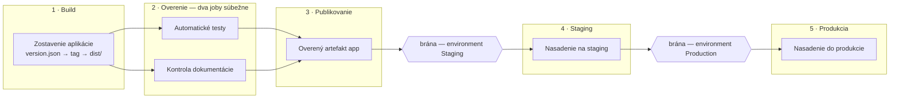

# Kalkulačka poistenia — config repo

The configuration side of the workshop setup (`kalkulacka-config`). It holds the
pipeline, the version pointer and the release documentation. The application
code lives in the vendor repo (`EDU/EDU` on `adoserver.koop.sk`) and is never
edited here.

## Project structure

| Path                    | Responsibility                                                     |
| ----------------------- | ------------------------------------------------------------------ |
| `azure-pipelines.yml`   | The full pipeline: Build → Verify → Publish → Staging → Production. |
| `version.json`          | Which vendor tag gets built — `{ "version": "v1.2.1" }`.            |
| `docs/CHANGELOG.md`     | Release notes; must mention the version being deployed.            |
| `docs/popis-zmeny.md`   | Description of the change for the approver.                        |
| `ci/`                   | Bash scripts the pipeline steps call.                              |

## Releasing a version

Editing `version.json` *is* the release. The pipeline reads the version at run
time and clones the vendor repo at that tag, so bumping a version never means
editing the pipeline:

```json
{ "version": "v1.2.1" }
```

Then update `docs/CHANGELOG.md` so it names the same version — the `docs` job
fails the build if it doesn't.

## Pipeline stages

Left to right, one container per stage. Jobs drawn on top of each other inside a
container run in parallel; the gates between the deployment stages are the
environment approvals, not steps in this file.



| Stage        | What it does                                                          |
| ------------ | --------------------------------------------------------------------- |
| `Build`      | Reads `version.json`, clones the vendor tag, produces `dist/`.        |
| `Verify`     | Two parallel jobs: `node --test` on the vendor tests, and the docs check. |
| `Publish`    | Publishes the verified `app` artifact — nothing unverified is published. |
| `Staging`    | Deployment job on the `Staging` environment.                          |
| `Production` | Deployment job on the `Production` environment.                       |

Approvals and checks are **not** in this file. They are configured on the
`Staging` and `Production` environments in Azure DevOps, which is what makes
the run pause for an approver.

`trigger: none` — runs are started by hand, so it is always visible who started one.

### `ci/`

Anything longer than a one-liner lives in a script rather than inline in the
YAML, so it can be run and debugged locally — `./ci/test-documentation.sh`
behaves the same in a shell as it does on the agent.

| Script                   | Called by                          |
| ------------------------ | ---------------------------------- |
| `get-vendor-source.sh`   | `Build`, `Verify / test`           |
| `build-package.sh`       | `Build`                            |
| `run-vendor-tests.sh`    | `Verify / test`                    |
| `test-documentation.sh`  | `Verify / docs`                    |
| `test-node-version.sh`   | `Verify / test`                    |
| `use-agent-node.sh`      | `Verify / test`                    |
| `deploy-site.sh`         | `Staging`, `Production`            |

The pipeline runs on Linux agents (`Pool1-Linux`) — the same pool as the vendor
repo. The steps use `bash`, and the only thing the agents need installed is
**git** — no PowerShell, and Node comes bundled with the agent (see below). That is deliberate: these agents are
on-prem behind a TLS-inspecting proxy, so every runtime dependency the pipeline
adds is something that has to be installed by hand on each machine and can fail
to download.

The pipeline neither downloads nor installs Node. Every Azure Pipelines agent
ships its own Node under `externals/node*/bin/node` for running tasks, and
`use-agent-node.sh` puts the newest one that actually runs and is v20 or newer
on `PATH` for the rest of the job. `test-node-version.sh` then confirms it. Only
`Verify / test` needs Node — `run-vendor-tests.sh` calls `node --test`.

`NodeTool@0` is not used: it downloads from nodejs.org, and behind the
TLS-inspecting proxy that fails with *unable to get local issuer certificate*.

The catch is that `externals/` is internal to the agent, not a supported
interface. An agent too old to bundle Node 20 — or a future agent that lays the
folder out differently — makes `use-agent-node.sh` fail with a message saying
so; the fix then is a newer agent or Node installed on the machines.

Steps call the scripts as `bash ./ci/<script>.sh`. Scripts committed through the
browser arrive without the execute bit, and going through `bash` ignores the
file mode. `.gitattributes` pins `*.sh` to LF so a CRLF checkout can't break the
shebang.

Each script uses `set -euo pipefail` and takes long options with sensible
defaults (`--version`, `--tag`, `--package-path`) instead of reading pipeline
variables directly — that is what makes them runnable outside CI. Failures are
reported with `##vso[task.logissue type=error]` plus a non-zero exit code.

Two of them are shared by more than one step, which is the point: the clone and
the deployment exist once, and staging and production differ only in the
arguments they pass.

Reading `version.json` stays inline in the YAML. It sets the stage output
variable every later stage depends on, and that wiring is easier to follow next
to the `name: readVersion` that exposes it.

`deploy-site.sh` without `--target-path` only lists the package — the workshop
mode. Adding `--target-path /var/www/kalkulacka/staging` turns it into a real
copy.

The trade-off of the move to bash is that the scripts no longer run on a Windows
workstation as-is — debugging them locally means WSL, macOS, or a Linux box.

## Not in this repo yet

`version.json` and `docs/` are referenced by the pipeline but not committed. A
run fails at the first step until `version.json` exists, and at the `docs` job
until both documents do.
