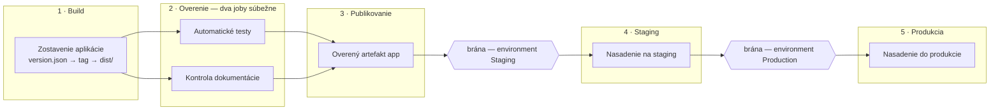

# Kalkulačka poistenia — config repo

The configuration side of the workshop setup (`kalkulacka-config`). It holds the
pipeline, the version pointer and the release documentation. The application
code lives in the vendor repo (`EDU/Dev` on `adoserver.koop.sk`) and is never
edited here.

## Project structure

| Path                    | Responsibility                                                     |
| ----------------------- | ------------------------------------------------------------------ |
| `azure-pipelines.yml`   | The full pipeline: Build → Verify → Publish → Staging → Production. |
| `version.json`          | Which vendor tag gets built — `{ "version": "v1.2.1" }`.            |
| `docs/CHANGELOG.md`     | Release notes; must mention the version being deployed.            |
| `docs/popis-zmeny.md`   | Description of the change for the approver.                        |
| `ci/`                   | PowerShell scripts the pipeline steps call.                        |

## Releasing a version

Editing `version.json` *is* the release. The pipeline reads the version at run
time and clones the vendor repo at that tag, so bumping a version never means
editing the pipeline:

```json
{ "version": "v1.2.1" }
```

Then update `docs/CHANGELOG.md` so it names the same version — the `docs` job
fails the build if it doesn't.

## Pipeline stages

Left to right, one container per stage. Jobs drawn on top of each other inside a
container run in parallel; the gates between the deployment stages are the
environment approvals, not steps in this file.



| Stage        | What it does                                                          |
| ------------ | --------------------------------------------------------------------- |
| `Build`      | Reads `version.json`, clones the vendor tag, produces `dist/`.        |
| `Verify`     | Two parallel jobs: `node --test` on the vendor tests, and the docs check. |
| `Publish`    | Publishes the verified `app` artifact — nothing unverified is published. |
| `Staging`    | Deployment job on the `Staging` environment.                          |
| `Production` | Deployment job on the `Production` environment.                       |

Approvals and checks are **not** in this file. They are configured on the
`Staging` and `Production` environments in Azure DevOps, which is what makes
the run pause for an approver.

`trigger: none` — runs are started by hand, so it is always visible who started one.

### `ci/`

Anything longer than a one-liner lives in a script rather than inline in the
YAML, so it can be run and debugged locally instead of only on an agent.

| Script                   | Called by                          |
| ------------------------ | ---------------------------------- |
| `Get-VendorSource.ps1`   | `Build`, `Verify / test`           |
| `Build-Package.ps1`      | `Build`                            |
| `Invoke-VendorTests.ps1` | `Verify / test`                    |
| `Test-Documentation.ps1` | `Verify / docs`                    |
| `Deploy-Site.ps1`        | `Staging`, `Production`            |

Names follow PowerShell's `Verb-Noun` convention using approved verbs. Each
takes parameters instead of reading pipeline variables directly — that is what
makes them runnable outside CI — and reports failures with
`##vso[task.logissue type=error]` plus a non-zero exit code.

Two of them are shared by more than one step, which is the point: the clone and
the deployment exist once, and staging and production differ only in the
arguments they pass.

Reading `version.json` stays inline in the YAML. It sets the stage output
variable every later stage depends on, and that wiring is easier to follow next
to the `name: readVersion` that exposes it.

`Deploy-Site.ps1` without `-TargetPath` only lists the package — the workshop
mode. Adding `-TargetPath \\server\stranka\staging` turns it into a real copy.

## Not in this repo yet

`version.json` and `docs/` are referenced by the pipeline but not committed. A
run fails at the first step until `version.json` exists, and at the `docs` job
until both documents do.
